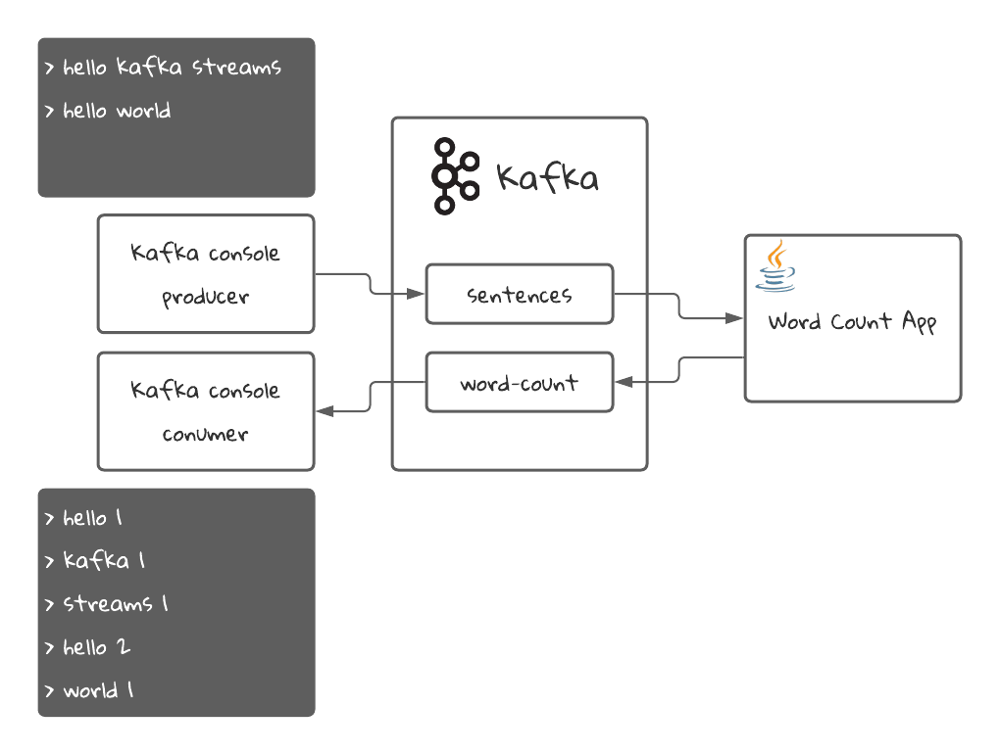
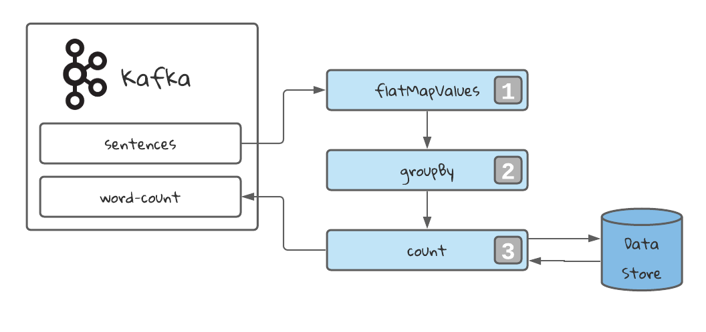

# Kafka Streams Word Count Application
The Kafka Streams word count application is the classic "Hello World!" example for Kafka Streams.
It helps to introduce some main concepts of the library.

## Video Tutorial
By the way, you can follow me on YouTube for more Software Engineering Content in my channel [Programming with Mati](https://www.youtube.com/channel/UC0clXTEN6Fu277RTw6jCfAg).
<iframe align="center" width="560" height="315" src="https://www.youtube.com/embed/MR5hllNC9hk" frameborder="0" allow="autoplay; encrypted-media" allowfullscreen></iframe>
## Code
You can find the code of this project in the Github repository [Kafka Streams Word Count](https://github.com/Programming-with-Mati/kafka-streams-word-count)
## Application Diagram
Here is a simple diagram for this application:


The Java application will read sentences from the `sentences` topic in Kafka and will count the amount of times each word has appeared in all the sentences. Then it will stream the latest count for each word into the `word-count` topic, which we will read with a Kafka console consumer.
## Requirements
* Docker: We will use it to start Kafka and create the topics. Here is [Docker's download link](https://www.docker.com/products/docker-desktop)
* Java 15: [Download Link](https://www.oracle.com/java/technologies/javase-jdk16-downloads.html)
* An IDE like Intellij IDEA

## Running the project

### Starting Kafka
First, we need to start Kafka. For that we have a [docker-compose.yml file](https://github.com/Programming-with-Mati/kafka-streams-word-count/blob/main/docker-compose.yml) that will create the necessary resources for us. It will start a Zookeeper instance and a Kafka broker. It will also create the necessary topics using the script found in the [create-topics.sh](https://github.com/Programming-with-Mati/kafka-streams-word-count/blob/main/scripts/create-topics.sh) file.
```shell
docker compose -f ./docker-compose.yml up
```
### Building and starting the application
```shell
./mvnw compile exec:java -Dexec.mainClass="com.github.programmingwithmati.kafka.streams.wordcount.WordCountApp"
```
### Publishing a message and consuming the results
1. we need to connect to the docker container to run commands on a CLI:
```shell
docker exec -it kafka /bin/bash
```
2. we create a console consumer to consume the `word-count` topic:
```shell
kafka-console-consumer --topic word-count --bootstrap-server localhost:9092 \
 --from-beginning \
 --property print.key=true \
 --property key.separator=" : " \
 --key-deserializer "org.apache.kafka.common.serialization.StringDeserializer" \
 --value-deserializer "org.apache.kafka.common.serialization.LongDeserializer"
```
3. Open a new terminal and connect again to the kafka docker container:
```shell
docker exec -it kafka /bin/bash
```
4. Create a console producer to insert sentences in the `sentences` topic:
```shell
kafka-console-producer --topic sentences --bootstrap-server localhost:9092
```
5. In your console producer, insert the following messages:
```
>Hello kafka streams
>Hello world
```
6. In your console consumer terminal, you should see the following result:
```
hello : 1
kafka : 1
streams : 1
hello : 2
world : 1
```
What you see is the words that we inserted in step 5, followed by the amount of times that word was processed. That's why the word `hello` appears twice.

## Understanding the Topology
The **topology** of a Kafka Streams Application refers to the way in which the data will be processed in the stream. When we define a Topology, what we are doing is defining a set of operations which will transform the data as it is streamed.
The programming paradigm used by Kafka Streams is called **dataflow programming**. The logic of the application is structured as a **Direct Acyclic Graph (DAG)**. There are several advantages of this paradigm:
 * Easy to understand
 * Easy to standardize
 * Easy to visualize
 * Easy to parallelize


1️⃣ **Flat Map** operation to map 1 record into many. In our case, every sentences is mapped into multiple records: one for each word in the sentence. Also the case is lowered to make the process case-insensitive.

2️⃣ **Group By** the stream selecting a grouping key. In our case, the word. This will always return grouped stream, prepared to be aggregated. It will also trigger an operation called **repartition**. We will learn more about this later.

3️⃣ **Count** every appearance of the key in the stream. This will be stored in a **data store**.

Finally, we stream the results into the topic `word-count`. We can stream a table using the method `toStream`, which will stream the latest value that was stored for a given key, everytime that key is updated.

## Taking a look at the code
In the class [WordCountApp](https://github.com/Programming-with-Mati/kafka-streams-word-count/blob/main/src/main/java/com/github/programmingwithmati/kafka/streams/wordcount/WordCountApp.java) we can see the following code:
```java

public class WordCountApp {
    
}
    public static void main(String[] args) {
        // 1. Load Kafka Streams properties
        Properties props = getConfig(); 

        StreamsBuilder streamsBuilder = new StreamsBuilder();
        // 2. Build the Topology
        streamsBuilder.<String, String>stream("sentences")
        .flatMapValues((key, value) -> Arrays.asList(value.toLowerCase().split(" "))) // Flat Map Values splits the sentences into words, and creates multiple entries in the stream
        .groupBy((key, value) -> value) // groupBy groupes all values in the stream by a given criteria, in this case, the same word. It becomes the key of the stream
        .count(Materialized.with(Serdes.String(), Serdes.Long())) // count converts the KStream in a KTable, storing the data in a Data Store. By default is RocksDB
        .toStream() // Transform the KTable into a KStream to stream every change in the state
        .to("word-count", Produced.with(Serdes.String(), Serdes.Long())); // Finally, stream the results into the word-count topic
        // 3. Create the Kafka Streams Application
        KafkaStreams kafkaStreams = new KafkaStreams(streamsBuilder.build(), props);
        // 4. Start the application
        kafkaStreams.start();

        // attach shutdown handler to catch control-c
        Runtime.getRuntime().addShutdownHook(new Thread(kafkaStreams::close));
    }
    // ...
}
```
As you can see, the High Level DSL is very easy and intuitive to use. The fact that works as a fluent API makes it very easy to read an maintain as well.

## Next Tutorial
In our next tutorial, we will be creating a Streams application to transform Speech into text and to parse voice commands. We will use Stateless operations, and we will learn about the interface KStream.
